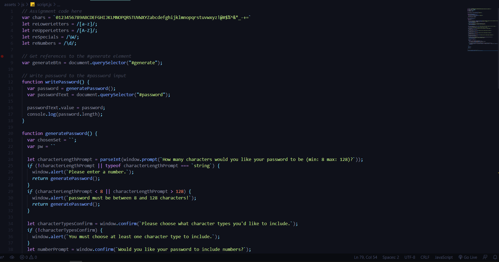
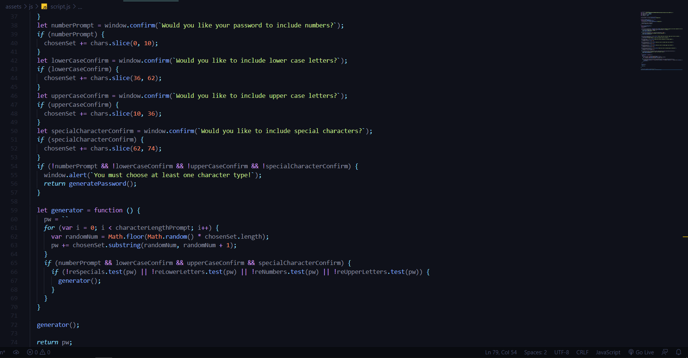
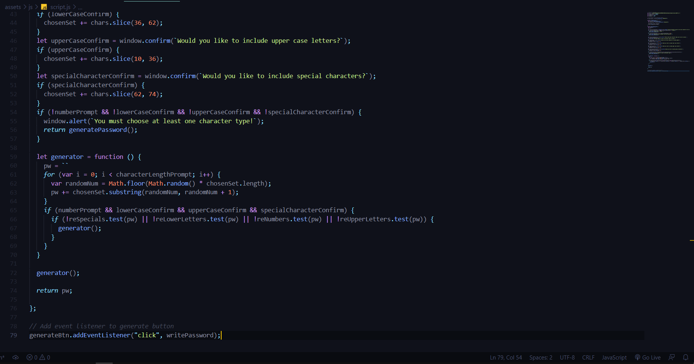

# Random Password Generator in Javascript
## Description
In this challenge javascript was used in order to create code that would randomly generate a password based on the parameters set by the user of the web application.

## Screenshots

## Links
https://lclark31.github.io/password-generator/